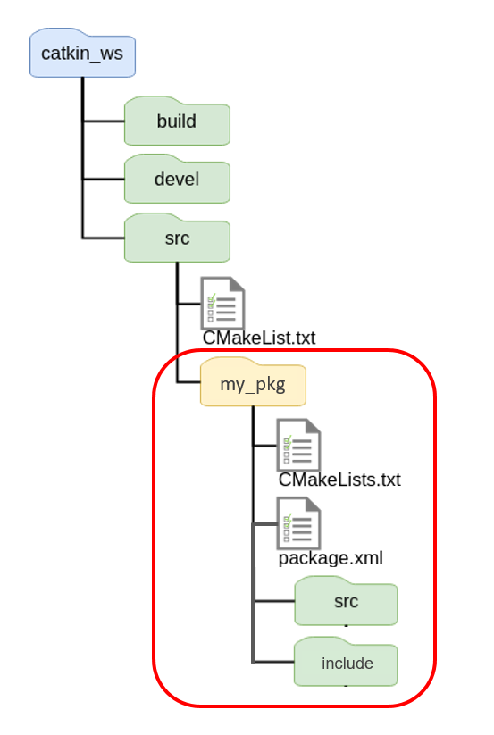
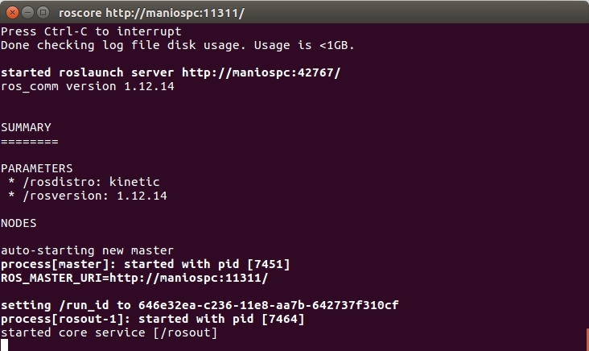
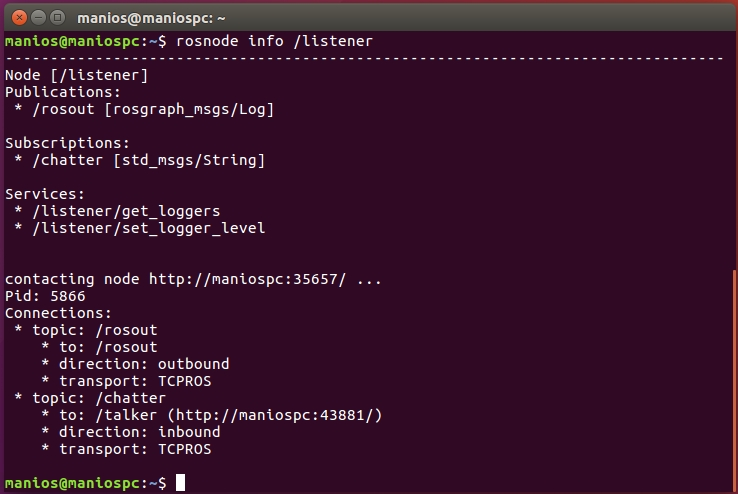
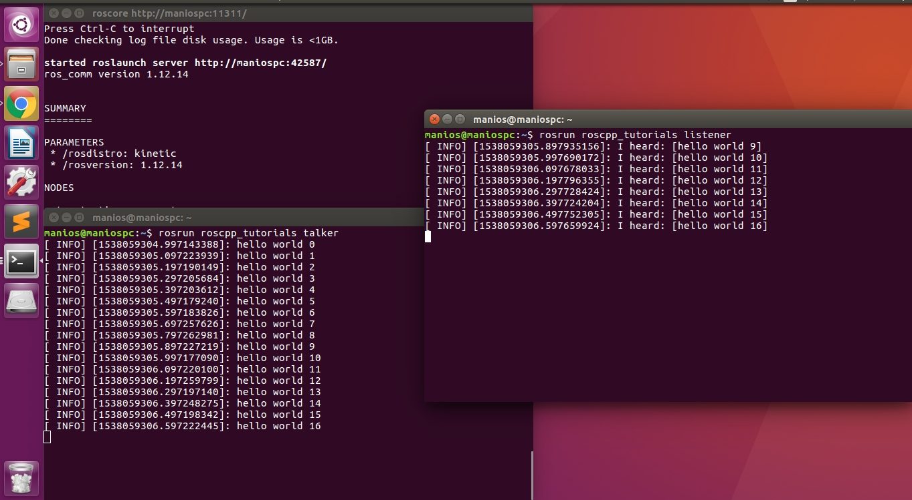
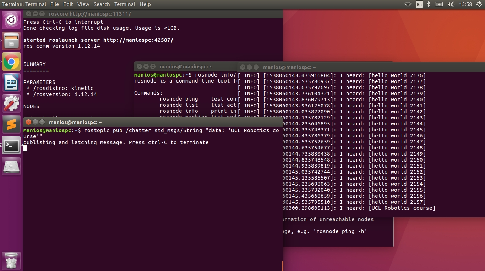
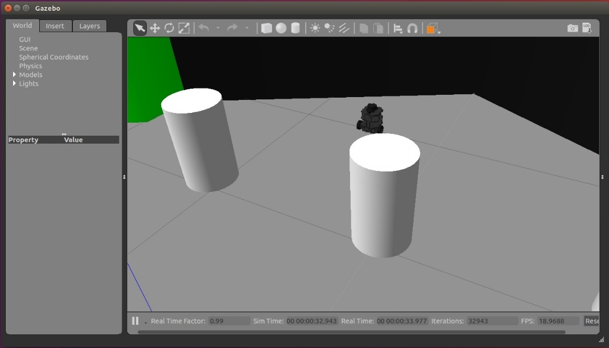
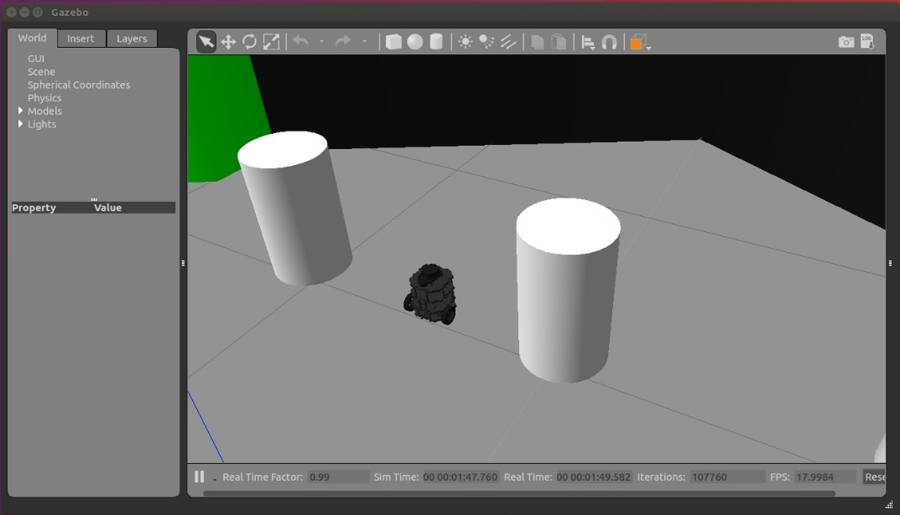
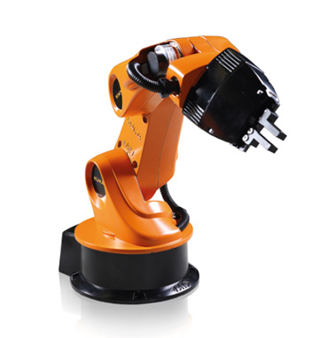
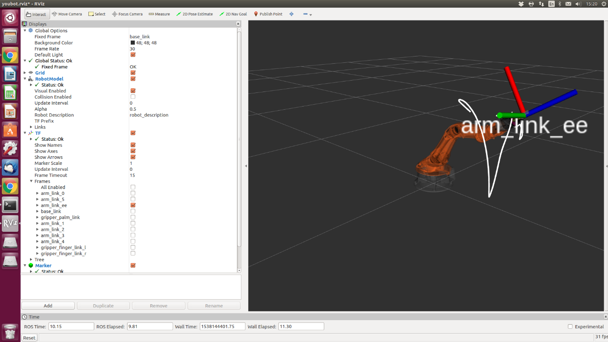
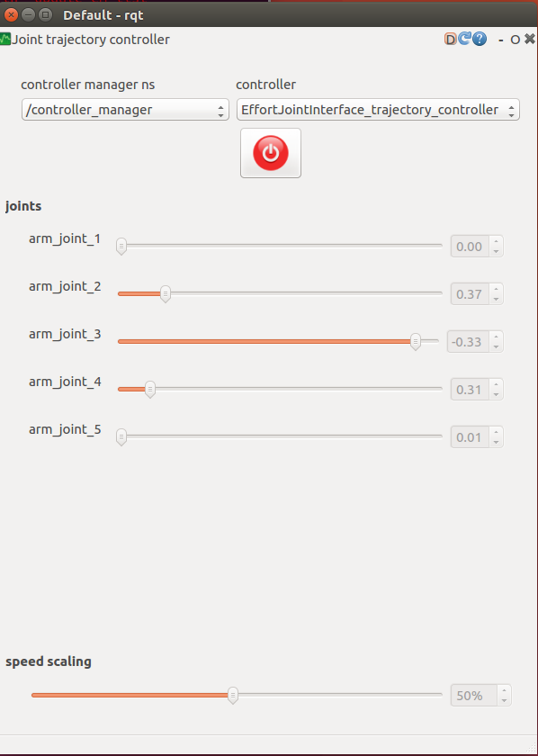

# **MPHY0054_lab Robotic Systems Engineering Lab 01**


**Module lead:** Dr. Agostino Stilli

**TAs:** Solène Dietsch, Katie Doyle, Aoife McDonald-Bowyer, Ziting Liang


# **Contents**

1. [Introduction to ROS](#introduction-to-ros)
   
   1.1. [What is ROS?](#what-is-ros)
   
   1.2. [Why is ROS useful?](#why-is-ros-useful)
   
   1.3. [ROS Pros and Cons](#ros-pros-and-cons)
   
   1.4. [ROS Components](#ros-components)
   
      1.4.1. [Packages](#packages)
   
      1.4.2. [Catkin Workspace](#catkin-workspace)
   
      1.4.3. [Master](#master)
   
      1.4.4. [Nodes](#nodes)
   
      1.4.5. [Topics](#topics)
   
      1.4.6. [Messages](#messages)
   
      1.4.7. [Services](#services)
   
      1.4.8. [Launchfiles](#launchfiles)
   
      1.4.9. [rqt_graph and rqt_plot](#rqt_graph-and-rqt_plot)
   
   1.5. [Resources](#resources)

3. [Examples](#examples)
   
   2.1. [Talker Listener Example](#talker-listener-example)
   
   2.2. [TurtleBot Example](#turtlebot-example)
   
   2.3. [Youbot Example](#youbot-example)


## **Introduction to ROS**

### **What is ROS?**

ROS stands for 'Robot Operating System' and its official wiki
description is 'ROS is an open-source, meta-operating system for your
robot. It provides the services you would expect from an operating
system, including hardware abstraction, low-level device control,
implementation of commonly used functionality, message-passing between
processes, and package management. It also provides tools and libraries
for obtaining, building, writing, and running code across multiple
computers.'


In a few words, ROS is an open-source framework for robotics, whose main
goal is to support code reuse and promote collaboration in robotics
research and development. It's not an actual operating system, but more
of a 'middleware', an abstraction layer that resides between the
operating system and software applications.


## **Why is ROS useful?**

ROS can be broken down to its four main characteristics:

-   Plumbing: ROS provides publish-subscribe messaging infrastructure
    designed to support quick and easy construction of distributed
    computing systems

-   Tools: ROS provides an extensive set of tools for configuring,
    starting, introspecting, debugging, visualizing, logging, testing,
    and stopping distributed computing systems.

-   Capabilities: ROS provides a broad collection of libraries that
    implement useful robot functionality, with a focus on mobility,
    manipulation and perception.

-   Ecosystem: ROS is supported and improved by a large community, with
    a strong focus on integration and documentation.

To sum up, using ROS helps into tackling some of the many issues that
one often finds in developing robots such as cooperation between
hardware and software, architectural differences in robotic systems and
software modularity or reusability.


## **ROS Pros and Cons**

| Pros                               | Cons                                                     |
|-----------------------------------|----------------------------------------------------------|
| - Takes care of lots of low-level issues (communication, drivers, etc) | - It is not real-time                                    |
| - Modular design and software reusability | - Modular design may be inefficient compared to integrated design |
| - Open-source and great community support | - Running ROS code requires additional devices capable of running ROS |
| - Large number of ready-to-use packages available |                                                          |


## **ROS components**

### **Packages**



A ROS package is a coherent collection of files that serves a specific
purpose, and all ROS software is organized into packages. A single
package contains a source folder, an include folder, a CMakeList.txt
file and a package.xml file.

The source folder consists of the source files whereas the include
folder of the header files. The other two files are a bit more
complicated.

The file CMakeLists.txt is the input to the CMake build system for
building software packages. Any CMake-compliant package contains one or
more CMakeLists.txt file that describe how to build the code and where
to install it to. The overall structure of a CMakeLists.txt file is:

1. Required CMake Version (cmake_minimum_required)
2. Package Name (project())
3. Find other CMake/Catkin packages needed for build (find_package())
4. Enable Python module support (catkin_python_setup())
5. Message/Service/Action Generators(add_message_files(), add_service_files(), add_action_files())
6. Invoke message/service/action generation (generate_messages())
7. Specify package build info export (catkin_package())
8. Libraries/Executables to build (add_library()/add_executable()/target_link_libraries())
9. Tests to build (catkin_add_gtest())
10. Install rules (install())

The package manifest is an XML file called package.xml that must be
included with any catkin-compliant package\'s root folder. This file
defines properties about the package such as the package name, version
numbers, authors, maintainers, and dependencies on other catkin
packages. An example of a package.xml file for a 'foo_core' package is
the following:

```
<package format="2">
    <name>foo_core</name>
    <version>1.2.4</version>
    <description>
    This package provides foo capability.
    </description>
    <maintainer email="email@email.org">Name Surname</maintainer>
    <license>BSD</license>
</package>
```

Some useful console ROS package commands are:

  ```sudo apt-get install ros-noetic-package``` - installs a single package
  
  ```catkin_create_pkg pkg_name dep1 dep2``` - creates a single package in a catkin_ws with dependencies
  
  ```rospack help [options] package_name``` - help menu
  
  ```rospack list``` - displays list of all packages
  
  ```rospack find package_name``` - returns the absolute package path
  
  ```rospack depends package_name``` - displays a list of all the pkg dependencies
  

### **Catkin Workspace**

A catkin workspace is a folder where you modify, build and install
catkin packages. It has four main sub-folders: source, build, devel and
install.

The source space contains the source code of catkin packages. This is
where you can extract/checkout/clone/source code for the packages you
want to build. Each folder within the [source
space](http://wiki.ros.org/catkin/workspaces#Source_Space) contains one
or more catkin packages. The [build
space](http://wiki.ros.org/catkin/workspaces#Build_Space) is where CMake
is invoked to build the catkin packages in the [source
space](http://wiki.ros.org/catkin/workspaces#Source_Space). CMake and
catkin keep their cache information and other intermediate files here.
The [development
space](http://wiki.ros.org/catkin/workspaces#Development_.28Devel.29_Space)
(or [devel
space](http://wiki.ros.org/catkin/workspaces#Development_.28Devel.29_Space))
is where built targets are placed prior to being installed. The way
targets are organized in the [devel
space](http://wiki.ros.org/catkin/workspaces#Development_.28Devel.29_Space)
is the same as their layout when they are installed. Once targets are
built, they can be installed into the [install
space](http://wiki.ros.org/catkin/workspaces#Install_Space) by invoking
the install target.

To create a Catkin Workspace type in a console:

```
source /opt/ros/noetic/setup.bash

mkdir -p ~/catkin_ws/src

cd ~/catkin_ws/

catkin_make

source devel/setup.bash
```

```catkin_make``` - is a convenience tool for building code in a catkin workspace

```source devel/setup.bash``` - is used to source your setup.bash file

By sourcing this file, you are adding several environment variables that
ROS needs in order to work.

### **Master**

The ROS Master is part of the so-called 'ROS core', a set of three
programs that are necessary for the ROS runtime. The master negotiates
communication connections, provides name registration and lookup for ROS
graph resources. The master should continue running for the entire time
that ROS is being used. One reasonable workflow is to start the master
in one terminal, then open other terminals for your work.

To start the master type in a console:

```
roscore
```



And to kill it just press Ctrl+C.

### **Nodes**

ROS nodes are processes that perform computation to absolve some task
(e.g. read sensors or control motors) and communicate with other nodes
using the ROS infrastructure. Nodes are implemented using client
libraries.

To run a node type in a console:

```
rosrun package_name executable_name
```

Both those names are defined in the CMakeLists.txt file.

To get information about nodes that are already running:

```
rosrun <command>
```

such as ```rosnode list```, or ```rosnode info node_name```. For example, if we ask
for information about the 'listener' node that we run in the first
example of Lab02 then we get:



### **Topics**

Topics are named channels for communication, where messages of the same
kind are exchanged. Communication between nodes follows the
publish/subscribe paradigm: a node sends out a message by publishing it
to a topic, and another node reads it by subscribing to that same topic.
Multiple nodes can publish messages on a topic and multiple nodes can
also read messages from a topic. Having said that, it is important to
mention that communication is asynchronous, meaning that it doesn't take
into consideration the timing or the ordering of the messages.

Some useful console ROS package commands are:
  -----------------------------------------------------------------------
  
  ```sudo apt-get install ros-noetic-package``` - installs a single package
  
  ```catkin_create_pkg pkg_name dep1 dep2``` - creates a single package in a catkin_ws with dependencies
  
  ```rospack help [options] package_name``` - help menu
  
  ```rospack list``` - displays list of all packages
  
  ```rospack find package_name``` - returns the absolute package path
  
  ```rospack depends package_name``` - displays a list of all the pkg dependencies
  
  ```rostopic <command> [options]``` - to get information about ROS topics
  
  ```rostopic list``` - list of active topics

  ```rostopic echo topic_name``` - print messages to screen

  ```rostopic hz topic_name``` - display publishing rate of topic

  ```rostopic type topic_name``` - display type about active topic

  ```rorsopic info topic_name``` - print information about active topic

  ```rostopic pub --r rate_hz topic_name message_type message_content``` - print information about active
                    

### **Messages**

Messages are used by nodes to communicate with each other. A message is
a data structure, comprising typed fields (predefined ROS messages,
custom messages). A message can include a timestamp, something
especially useful when dealing with sensor data. An example of a message
is the following:

```
std_msgs/Header.msg
uint32 seq
time stamp
string frame_id
```

```
std_msgs/String.msg
string.data
```


### **Services**

The publish/subscribe model is a very flexible communication paradigm,
but its many-to-many one-way transport is not appropriate for RPC
request/reply interactions, which are often required in a distributed
system. Request/reply is done via a service*,* which is defined by a
pair of [messages](http://wiki.ros.org/Messages): one for the request
and one for the reply. A providing ROS [node](http://wiki.ros.org/Nodes)
offers a service under a string [name](http://wiki.ros.org/Names), and a
client calls the service by sending the request message and awaiting the
reply. Client libraries usually present this interaction to the
programmer as if it were a remote procedure call. Services are defined
using [srv](http://wiki.ros.org/srv) files, which are compiled into
source code by a ROS client library.

Some useful console ROS service commands are:

  ```rosservice list``` - to get a list of services that are currently active
  
  ```rosnode info node_name``` - to see all services offered by a particular node

  ```rosservice node service_name``` - to find a node offering a specific service
  
  ```rosservice info service_name``` - to determine the service data

### **Launchfiles**

The launch file is a mechanism that ROS provides for starting the master
and many nodes all at once. It includes information on the nodes and
options to automatically respawn processes that have already died. The
use of launch files is widespread throughout many ROS packages since
those files are a very convenient way to specify and configure which
nodes are used in a package with multiple nodes.

An example of a launch file that starts two nodes at once is the
following:

```
<launch>
    <node
        pkg="turtlesim"
        type="turtlesim_node"
        name="turtlesim"
        respawn="true"
    />
    <node
        pkg="turtlesim"
        type="turtle_teleop_key"
        name="teleop_key"
        required="true"
        launch-prefix="xterm -e"
    />
</launch>
```

To run a launch file type in the console:

```roslaunch package_name file.launch arg1:=input1 arg2:=input2```

An efficient way to work with launch files is using the <arg> tag. The
<arg> tag allows you to create more re-usable and configurable launch
files by specifying values that are passed via the command-line, passing
in via an <include>, or declared for higher-level files. Args are not
global. An arg declaration is specific to a single launch file, much
like a local parameter in a method and you must explicitly pass arg
values to an included file.

Similar to the <arg> tag is the <param> tag. The <param> tag
defines a parameter to be set on the Parameter Server. Instead of value,
you can specify a textfile, binfile or command attribute to set the
value of a parameter. The <param> tag can be put inside of a <node>
tag, in which case the parameter is treated like a private parameter.

### **rqt_graph and rqt_plot**

rqt_graph provides a GUI plugin for visualizing the ROS computation
graph. Its components are made generic so that other packages where you
want to achieve graph representation can depend upon this package. Very
similarly, rqt_plot provides GUI plugin visualizing numeric values in a
2D plot using different plotting backends.


To run rqt_graph simply type: rqt_graph into a console.

To run rqt_plot you must run:
  
  ```rosdep install rqt_plot``` - for the first time only
  
  ```rqt_plot``` - for every other time

## **Resources**

As mentioned in the start of this introduction, one of the main
advantages of ROS is its open-source character and its wide online
support.

[https://wiki.ros.org](https://wiki.ros.org/) - The ROS Wiki is a
massive database with Documentation on a variety of resources, from
install instructions, to tutorials and publications.

<https://www.cse.sc.edu/~jokane/agitr/agitr-letter.pdf> - 'A gentle
introduction to ROS' by Jason M. O'Kane, University of South Carolina is
an extensive look into getting started with ROS.

# **Examples**

Now we are going to see some of the things above in action.

## **Talker Listener Example**

Run the three commands you see below, each one in a different terminal:

```
roscore

rosrun rospy_tutorials talker

rosrun rospy_tutorials listener
```

After we initiated the ROS master with 'roscore', we then ran two nodes
of the same 'rospy_tutorials' package. The 'talker' node is the
publisher which publishes a simple 'hello world' string alongside a
corresponding timestamp, and the 'listener' node, the subscriber,
subscribes to it and receives the message.

On another terminal type:

```
rostopic list
```



We can see three topics appearing. The one we are interested in is
'/chatter' because that is the one that the two nodes use.

We can also get information on the two nodes by typing:

```
rosnode info /talker

rosnode info /listener
```

Now kill the 'talker' node by pressing 'Ctrl+C' because will publish a
message on the subscriber node ourselves. Type:

```
rostopic pub /chatter std_msgs/String 'data: UCL robotics course'
```



Terminate every console, including the master, by pressing 'Ctrl+C'.

## **TurtleBot Example**


TurtleBot is an open-source hardware platform and
mobile base. When powered by ROS, TurtleBot can handle vision,
localization, communication and mobility. In this example we will run
the simulation of the TurtleBot robot in Gazebo, and teleoperate it with
the keyboard.

Gazebo is a 3D rigid body simulator for robots. A set of packages
(gazebo_ros_pkgs) is a set of ROS packages that provide the necessary
interfaces to simulate a robot in the Gazebo 3D environment. It
integrates with ROS using ROS messages and services. There is no need
for a standalone installation of Gazebo since it's part of the full ROS
installation.

First, we need to download and 'catkin_make' the necessary packages to
run the TurtleBot simulation. To do this, we are going to use the git
control system. Without going into much detail, Git is
a [version-control](https://en.wikipedia.org/wiki/Version-control) system
for tracking changes in [computer
files](https://en.wikipedia.org/wiki/Computer_file) and coordinating
work on those files among multiple people. It is primarily used for
source-code management in [software
development](https://en.wikipedia.org/wiki/Software_development), but it
can be used to keep track of changes in any set of files. Instead of
manually downloading and saving a specific set of files (repository)
from their github.com page, you can directly 'clone' this repository
into your desired location.

Navigate into the source folder of your workspace and clone the two
repositories, 'turtlebot3' and 'turtlebot3_simulations'. Then, navigate
back to your main workspace folder and 'catkin_make' the code and source
the setup.bash file.

First, create a ‘catkin workspace’ be following the instructions in 1.4.2, 
if you have not done so already.

```
cd ~/catkin_ws/src
```

Clone the three packages to your catkin_ws/src folder:

```
git clone https://github.com/ROBOTIS-GIT/turtlebot3.git

git clone https://github.com/ROBOTIS-GIT/turtlebot3_msgs.git

git clone https://github.com/ROBOTIS-GIT/turtlebot3_simulations.git
```

Return to your catkin_ws folder:

```
cd ..
```

Build using catkin_make:

```
catkin_make
```

Source the setup file generated by catkin_make:

```
source devel/setup.bash
```

Now we have set up everything needed to run the TurtleBot simulator. To
actually run it, we have to choose which type of robot we want to
operate ('burger' or 'waffle') and then launch all the appropriate nodes
using a .launch file:

```
export TURTLEBOT3_MODEL="burger"

roslaunch turtlebot3_gazebo turtlebot3_world.launch
```

You can now see a basic environment with obstacles and the robot
somewhere near them. You can manipulate the camera however you want
(zoom in/out, change the orientation of the screen etc).



In a second terminal type the following and use your keyboard to move
the robot:

```
cd ~/catkin_ws

source devel/setup.bash

export TURTLEBOT3_MODEL="burger"

roslaunch turtlebot3_teleop turtlebot3_teleop_key.launch
```



## **Youbot Example**



This example shows the simulation of KUKA Youbot that we will be using
throughout the lab and the courseworks. The arm has 5 revolute joints,
thus 5 degrees of freedom.

To run the simulation, first we need to 'clone' some packages from the
lab repository:

```
cd ~/catkin_ws/src

git clone https://github.com/surgical-vision/comp0127_lab.git

cd ..

catkin_make

source devel/setup.bash
```

Before running this, you have to make sure that you install all the
dependencies. You can run this command from any directory, but make sure
you have a stable internet connection. Also, be sure to copy and paste
the whole command:

```
sudo apt install ros-noetic-controller-manager \
ros-noetic-joint-state-controller ros-noetic-effort-controllers \
ros-noetic-gazebo-ros-control ros-noetic-control-msgs \
ros-noetic-joint-trajectory-controller ros-noetic-velocity-controllers \
ros-noetic-ros-controllers ros-noetic-ros-control ros-noetic-rqt-gui-py \
ros-noetic-rqt-joint-trajectory-controller ros-noetic-trajectory-msgs \
ros-noetic-controller-manager-msgs ros-noetic-rospy ros-noetic-rqt-gui
```

For the first example, you can run the following command, after sourcing
your catkin environment:

```
roslaunch youbot_traj_example youbot_traj_py.launch
```

The output on the screen should look like this:



The rviz simulator shows the youbot arm moving around in the pre-defined
motion. You can see how the message is passed around each node by
running the following command in the second terminal:

```
rqt_graph
```

You can try playing around with the console in rviz to familiarise
yourself with the environment, for example:

-   Check the checkbox "arm_link_xx" to show the coordinate frame.

-   Adjust the value "alpha" under RobotModel to increase the opacity of
    the model.

**SIDE NOTE:**
The folder ‘comp0127_lab’ is the collection of the lab examples, 
lab tasks and packages required for running the simulation environment.
For this week, we only have ‘robot_description’, ‘youbot_simulator’ and ‘lab01’.

- ‘robot_description’ is the collection of the robots’ designs required for the simulation in rviz and gazebo.
  
- ‘youbot_simulator’ contains launch files and pre-configuration for the simulation. This doesn’t have any code in python.
  
- ‘lab01’ is the collection of the lab examples for the first lab.

To run the second example, type the following command in the first
terminal:

```
source ~/catkin_ws/devel/setup.bash

roslaunch youbot_traj_example youbot_rqt_example.launch trajectory_interface:=true
```

The simulation will pop up like the first example, but the robot is not
moving.

Then, run this in the second terminal:

```
source ~/catkin_ws/devel/setup.bash

rosrun rqt_joint_trajectory_controller rqt_joint_trajectory_controller --force-discover
```

An interface like this will pop-up and then you need to select the right
controller manager and controller from the drop down menus. From here,
you can adjust the sliders and observe the movement of the robot in
rviz. This tool can be used to check whether your kinematic chain is
implemented correctly.

Again, here you can run 'rqt_graph' to see how the messages are passing
to each node through different topics.




