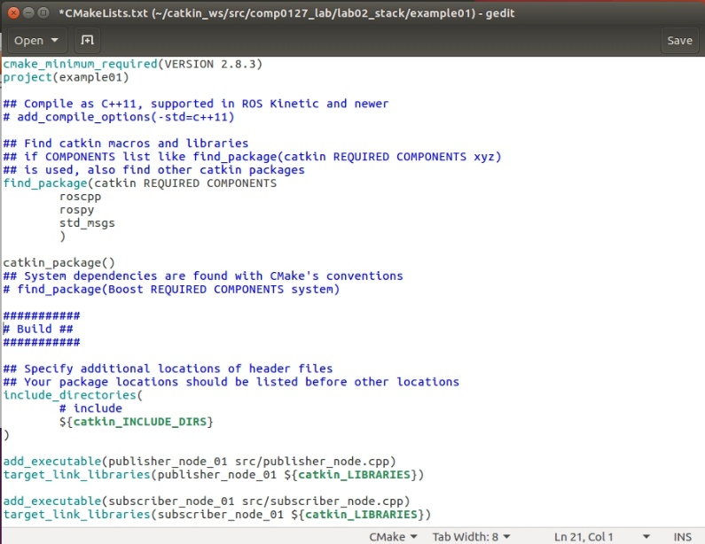
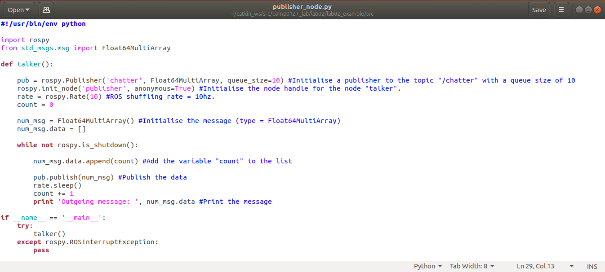
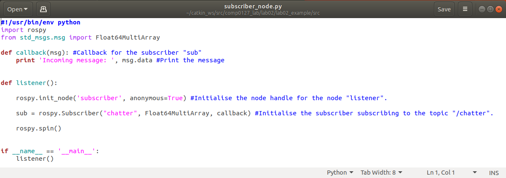
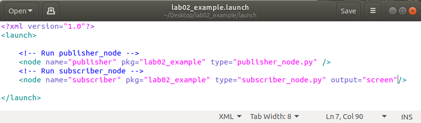
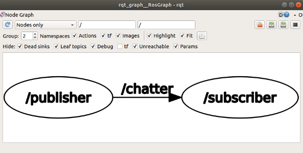

# **MPHY0054 obotic Systems Engineering Lab 02**

**Module lead:** Dr. Agostino Stilli

**TA team:** Solène Dietsch, Katie Doyle, Aoife McDonald-Bowyer, Ziting
Liang 

This document contains examples and exercises on writing code for simple
ROS communication. Navigate into the 'comp0127_lab' folder inside your
workspace and run:

```
git pull
```

to update your repository with the current lab folder. Then you should
'catkin_make' the workspace and source the environment as you were
taught in Lab 01.

# **CMakeLists.txt**

Before jumping into the examples let's go through a standard
CMakeLists.txt file to better understand how ROS works.


-   The first line sets the minimum version of CMake for this project.
    This option allows for future support for your build environment.
    The second line sets the project and package name.

- The 'find_package' command finds and loads settings from an external
  project. If the package is found, package-specific information is
  provided through variables and [Imported
  Targets](https://cmake.org/cmake/help/v3.0/manual/cmake-buildsystem.7.html#imported-targets)
  documented by the package itself.
- As described above, the 'find_package' command is a CMake command
  and is needed to load the catkin macros and specify dependencies to
  other ROS packages. The 'catkin_package' command is one of these
  catkin macros. It is responsible for the ROS-specific configuration
  of the package.
- The 'include_directories' command adds the given directories to
  those the compiler uses to search for include files.
- The 'add_executable' command defines our binary with all linked
  source files. It adds an executable target to be built from the
  source files listed in the command invocation.
- And finally, the 'target_link_libraries' command specifies libraries
  or flags to use when linking a given target. In a few words, we tell
  CMake to link those libraries to our executable.

# **Publisher / Subscriber example**

In this example, we will create a 'publisher / subscriber' application.
The publisher node publishes an Array of increasing size. For each
publishing loop, the array is appended with the variable 'count'. If
count = 0, then message = \[0\], if count = 1, then message = \[0 1\]
and so on.

We start by creating our package. Navigate into the lab02 folder inside
your catkin workspace and run the standard ROS command for creating a
package. You also need to include any other packages that this ROS
package will depend on. In this instance we will need 'rospy', the
standard ROS Python client library, and 'std_msgs' which includes
standard ROS message types, such as 'Int32', 'Float64' or 'String', and
for our purposes 'Float64MultiArray'.

```
cd ~/catkin_ws/src/comp0127_lab/lab02

catkin_create_pkg lab02_example rospy std_msgs
```

Now that we have created our package, we can populate the 'src' folder
with our ROS scripts.

The publisher node script is the following:



- Every Python ROS Node will have the declaration on the first line at
  the top. This first line makes sure your script is executed as a
  Python script. We then import 'rospy' to specify we write a ROS
  node, and the type of message from 'std_msgs.msg' that we want to
  use.

From Ubuntu 20.04 on, Python3 will come as the default python version.
If you get an error similar to "/usr/bin/env: 'python': No such file or
directory", try replacing "python" with "python3" in the first line.

- Inside the 'talker' function we define the publisher's interface to
  the rest of ROS.

  - 'rospy.Publisher' declares that our node is publishing to the
    'chatter' topic using the message type 'Float64MultiArray'. The
    'queue_size' argument limits the amount of queued messages if
    the subscriber is not receiving them fast enough. If you publish
    faster than your queue size can handle, some messages will be
    dropped.
  - The next command, 'init_node', tells rospy the name of our node
    so that it can start communicating with the ROS Master.
  - 'rospy.rate' offers a convenient way for looping at the desired
    rate. With a rate argument of 'x', we should expect to go
    through the loop 'x' times per second.
  - We then initialize the variable count, as well as the variable
    of type 'Float64MultiArray' that we want to use to publish our
    message.
  - This next loop is a standard rospy construct: checking the
    'rospy.is_shutdown()' flag and then doing \"work\". The
    'is_shutdown()' checks if your program should exit (e.g. if
    there is a Ctrl-C or otherwise). In this case, the \"work\"
    corresponds to the appending of the variable 'count' to the
    array variable, and the call to 'pub.publish(num_msg)' that
    publishes the data to our chatter topic. The loop calls
    rate.sleep(), which sleeps just long enough to maintain the
    desired rate through the loop.
- Finally, the last block of code, and in addition to the standard
  Python \_\_main\_\_ check, catches a rospy.ROSInterruptException
  exception, which can be thrown by rospy.sleep() and
  rospy.Rate.sleep() methods when Ctrl-C is pressed or your Node is
  otherwise shutdown.

The subscriber node script is the following:



- The first function is the 'callback' function. It will get called
  when a new message has arrived at the 'chatter' topic, and is the
  standard methodology when creating a ROS subscriber.
- Inside the 'listener' function we define the subscribers's interface
  to the rest of ROS.

  - 'rospy.Subscriber' declares that your node subscribes to the
    chatter topic which is of type
    'std_msgs.msgs::Float64MultiArray'. When new messages are
    received, callback is invoked with the message as the first
    argument.
  - rospy.spin() simply keeps your node from exiting until the node
    has been shutdown.

Now our first package containing a ROS 'publischer/subscriber'
application is ready. To run it, we need to **'catkin_make'** first, and
then in three separate terminals we run:

1st terminal:

```
roscore
```

2nd terminal:

```
cd ~/catkin_ws

source devel/setup.bash

rosrun lab02_example publisher_node.py
```

3rd terminal:

```
cd ~/catkin_ws

source devel/setup.bash

rosrun lab02_example subscriber_node.py
```

As a final step into creating our package, we can make a .launch file to
invoke the master and the two nodes all at once. Each node needs a
'name' argument, a 'pkg' argument which points to the package associated
with the node that is to be launched, and a 'type' argument which refers
to the name of the executable file. The 'output' argument is optional,
and instructs the launch file to output any 'print' statements of this
specific node on the terminal.



To run the launch file, and **while the Master is not
running**:

```
roslaunch lab02_example lab02_example.launch
```

To visualize the communication between the two nodes, on another
terminal, and while all other nodes are running, type the command
'rqt_graph' to see how the communication between the two nodes is taking
place using the GUI plugin for visualizing the ROS computation graph.



Change the pubsliher_node.py script ROS rate and either increase it or
decrease it. As expected, you affect the frequency at which the outgoing
message is published and consequently appearing on the terminal.
Finally, if you move the 'output = "screen"' parameter inside the
.launch file from the subscriber node to the publisher node, you will
notice that the terminal no longer outputs the 'Incoming message: '
statement, but rather the 'Outgoing message: ' statement.

Before running the following tasks, be sure that the following packages
are installed:

# **Tasks (not assessed)**

## **Task 01: ROS publisher/subscriber (already implemented)**

1. Create a publisher node that publishes a message which contains a
   random number between '0' and the variable 'count'.
2. Create a subscriber that receives this incoming message and prints
   it out.

## **Task 03: ROS publisher/subscriber with arguments in a callback function**

1. Create a publisher node that publishes a point on a unit circle on
   the XZ-plane.
2. Create a subscriber that receives the message and adds an offset.
3. Create a launch file to run both nodes at the same time.

## **Task 04: ROS launch and youbot control**

1. Create a publisher node that publishes commands for each joint of
   the youbot arm. Each command is a function of time as following.

$$
\theta_{1}(t) = \frac{200\pi}{180}\sin\left( \frac{2\pi t}{10} \right)
$$

$$
\theta_{2}(t) = \frac{50\pi}{180}\sin\left( \frac{2\pi t}{12} \right)
$$

$$
\theta_{3}(t) = - \frac{80\pi}{180}\sin\left( \frac{2\pi t}{15} \right)
$$

$$
\theta_{4}(t) = \frac{60\pi}{180}\sin\left( \frac{2\pi t}{11} \right)
$$

2. Create a launch file that runs the simulation and the robot.

For more information on ROS time functions, you can take a look at the
documentation [http://wiki.ros.org/rospy/Overview/Time](http://wiki.ros.org/rospy/Overview/Time)
