**MPHY0054 Robotic Systems Engineering Lab 04**

**Module lead:** Dr. Agostino Stilli

**TA team:** Ziting Liang, Chuang Lu, Tianchi Chen

This document contains a task on writing code for broadcasting the state
of a robot with tf2.

When doing tasks with a robot it is crucial that the robot be aware of
where it is itself, as well as where the rest of the world is in
relation to the robot. Having that information, the programmer could simply
request from a library the vector that they need to perform a specific
task, e.g. moving a gripper of a robot with respect to its main body, in
order to grasp some target. This is where the ‘tf’ library comes in.

# **The tf library**

The ```tf``` library was designed to provide a standard way to keep track of
coordinate frames and transform data within the entire system such that
individual component users can be confident that the data is in the
coordinate frame that they want without requiring knowledge of all the
coordinate frames in the system. ```tf``` maintains the relationship between
coordinate frames in a tree structure buffered in time, and lets the
user transform points, vectors, etc., between any two coordinate frames
at any desired point in time. In a few words, ```tf``` is a library for
keeping track of coordinate frames.

<p float="left">
  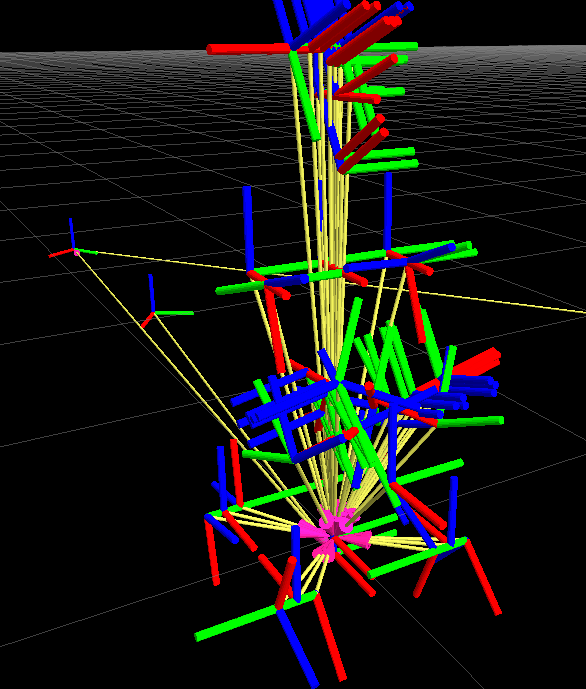
  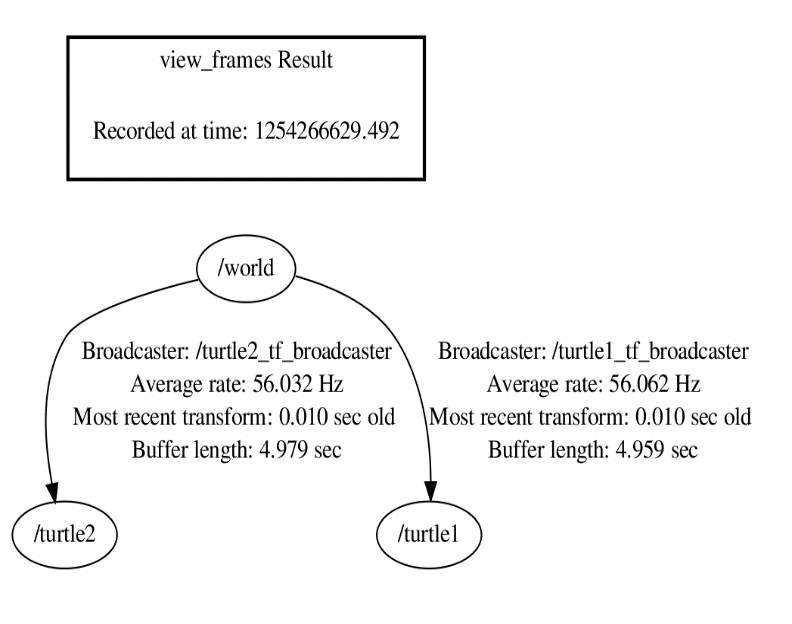
</p>


The ```tf``` library is most closely related to the concept of a scene graph
(a common type of data structure used to represent a 3D scene for rendering)
and can be separated into two different parts. The first part is disseminating
transform information to the entire system. The second part of the
library receives the transform information and stores it for later use.
The second part is then able to respond to queries about the resultant
transform between different coordinate frames.

Essentially, the library provides a transform between two coordinate
frames at a requested time. Its design mainly consists of two modules.
The ‘Broadcaster’ module takes care of the distribution, whereas the
‘Listener’ module performs the reception and the queries for the
transforms.

- *tf is closely represented by a tree*

Transforms and coordinate frames can be expressed as a graph with the
transforms as edges and the coordinate frames as nodes. However, with a
graph, two nodes may have multiple paths between them, resulting in two
or more potential net transforms introducing ambiguity to the problem.
To avoid this, we limit the ‘tf graph’ into a ‘tf tree’. Therefore,
although the ```tf``` library can be closely associated with a scene graph,
it is most closely represented by a tree that is designed to be queried
for specific values asynchronously, has the benefit of allowing for
dynamic changes to its structure and each update is specific to the time
at which it was measured.

- *tf stamp*

To be able to operate, all the data which is going to be transformed by
the ```tf``` library must contain two pieces of information: the coordinate
frame in which it is represented, and the time at which it is valid.
These two pieces of data are referred to as a ‘Stamp’. Data which
contains the information in the ‘Stamp’ can be transformed for known
data types.

- *Broadcaster/Listener modules*

The Broadcaster module was designed very simply. It broadcasts messages
every time an update is heard about a specific transform with a minimum
frequency. The Broadcasters send updates periodically whether they have
changed or not. The Listener collects the values into a sorted list and
when queried can interpolate between the two nearest values. Because the
Broadcaster send transforms regularly, the Listener does not ever assume
the presence of a coordinate frame into the future. That’s why it is
crucial to always choose the appropriate communication frequency.

- *The tf2 library*

In this course we are going to be using ```tf2```, which is the second
generation of the transform library, and as the first generation, lets
the user keep track of multiple coordinate frames over time.

## **Useful Commands**

```rosrun tf view_frames```  - creates a diagram of the frames being broadcast by tf over ROS

```evince frames.pdf```  - draws a tree of how the frames that are being broadcast over ROS are being broadcast over ROS are connected

```rosrun rqt_tf_tree rqt_tf_tree```  - a runtime tool for visualizing the tree of frames being broadcast over ROS

```rosrun tf tf_echo <reference_frame> <target_frame>```  - reports the transform between any two frames broadcast over ROS


# **Example**

As you do at the start of every lab, ```git pull``` inside the
```MPHY0054_lab``` folder, and ```catkin_make``` inside your workspace folder.

In a terminal run:

```
roslaunch lab04_example lab04_example.launch
```

Now in rviz, you can see a representation of the OpenManipulator with no
visible frames. To visualize the default frames this simulation is using
from the ```robot_state_publisher``` package, on the left, navigate to ‘Tf
-> Frames -> All enabled’. The ```robot_state_publisher``` package allows
you to publish the state of a robot to tf. It takes the joint angles
of the robot as input, and publishes the 3D poses of the robot links
using a kinematic tree robot model.

<p float="left">
  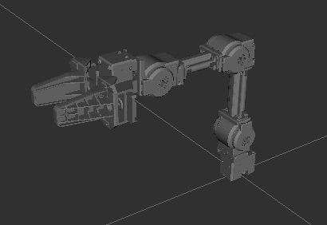
  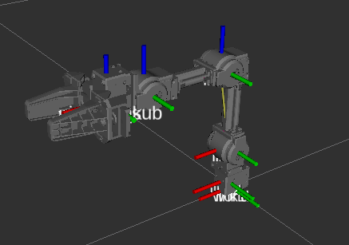
</p>

In this example, rather than using the pre-defined frames, we will
define our own frame and broadcast it over tf2, to appear in rviz.

Let’s take a look into the code.

The very first task we have to do is import our dependencies.

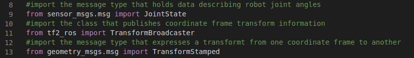

With the launchfile we invoke the ```joint_state_publisher_gui``` node, a
package used for controlling the joint angles of the simulated robot. We
first need to import the message type that holds the data with the the
robot joint angle values. If we are unsure on which topic these values
are published, we can use standard rostopic commands. By running
```rostopic list``` (see image below), we identify the appropriate topic being
```joint_states```, and by further looking into the topic, we see that the
corresponding message type is ```sensor_msgs/JointState```.

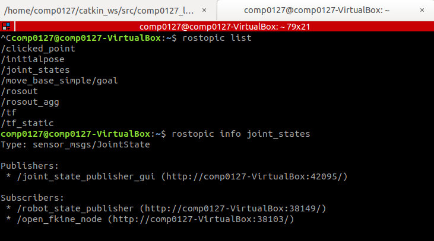

Next, we import the TransformBroadcaster, the tf2 class that publishes
the coordinate frame transformation information to tf2, and finally the
```geometry_msgs/TransformStamped``` message type which is compatible with
the broadcaster. This message type expresses a transform from the parent
coordinate frame ```header.frame_id``` to the child coordinate frame
```child_frame_id```.

After we define the DH parameters of the manipulator as presented in the
previous lab session, we need to define the name for our frames. In this
example we are publishing a single frame, and thus our ```name_link``` array
will only contain frame 1 from the presentation.

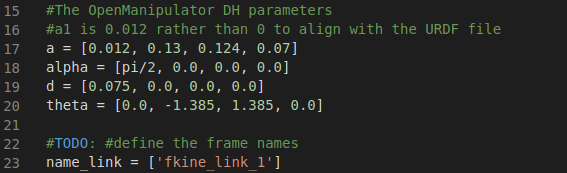

The following function is the forward kinematics function. Ideally, our
forward kinematics function should solve the forward kinematics by
multiplying frame transformations up until a specified frame number. For
example, the transformation would be:

$T_{1}^{0}$ for frame 1,

$T_{2}^{0} = T_{1}^{0}*T_{2}^{1}$ for frame 2,

$T_{3}^{0} = T_{1}^{0}*T_{2}^{1}*T_{3}^{2}$ for frame 3 and so on.

In this example, we are only solving for frame 1, so we can immediately
hard code the $T_{1}^{0}$  transformation for demonstration purposes. **Of course,
hard coding the $T_{i}^{0}$ transformations in your coursework would be
wrong**.

We then move into our main function:

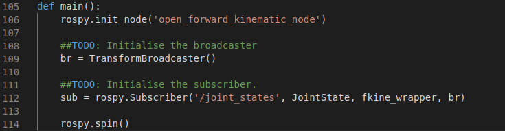

We initialise our TransformBroadcaster that will be broadcasting our
transforms to tf2. If we wanted to broadcast a static frame that never
changed position or orientation, we could immediately populate the
broadcaster fields and transform here, but our frame is a joint angle
frame and is dependent on joint angle θ1. Therefore, we need
to subscribe to the joint angles topic so that we know what this joint
angle value is and use the broadcaster as an argument to the callback
function.

Talking about the callback function, let’s define it.

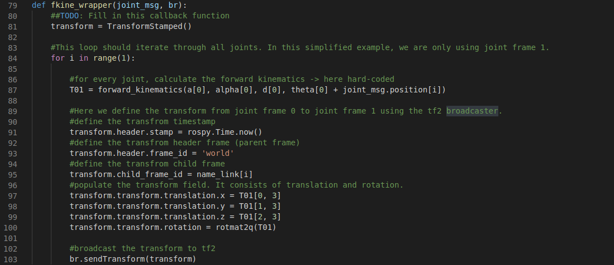

The callback function has the default message of ```JointState``` type that
we defined in the subscriber, and the broadcaster as an additional
argument. Our first step is to compute the forward kinematics function
which is dependent on the DH parameters, and specifically for θ, also on
the joint states that store the joint angle value.

Having computed the frame transformation matrix, we can populate the
```TransformStamped``` type message transform, and finally, broadcast to
tf2.

As a last step, add the new node to the launch file.

If we run our launch file again, we should be able to see our
```fkine_link_1``` frame in rviz, and by moving ```joint1```, we should see our
user-defined frame move accordingly.

<p float="left">
  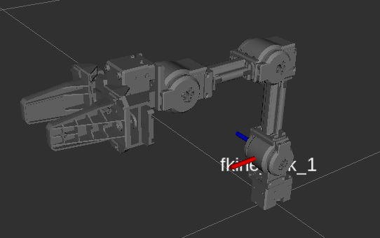
  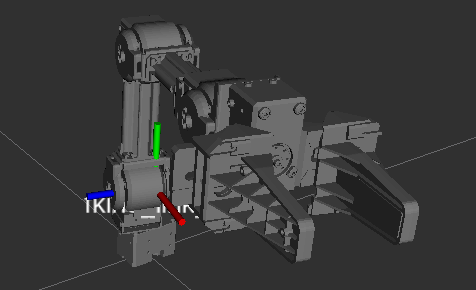
</p>
