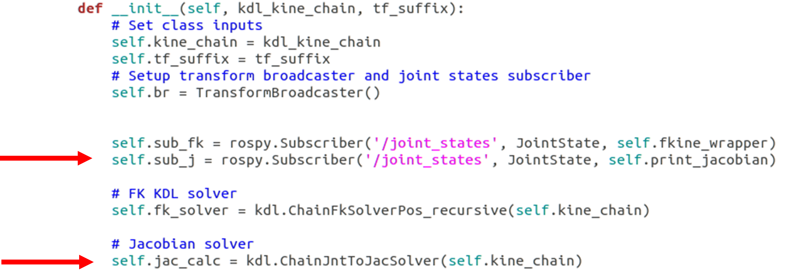
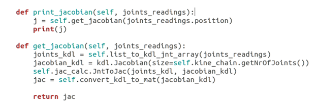

**MPHY0054 Robotic Systems Engineering Lab 04**

**Module lead:** Dr. Agostino Stilli

**TA team:** Ziting Liang, Chuang Lu, Tianchi Chen

This document contains an example of how to use KDL library to compute the Jacobian for the Youbot manipulator. Knowledge of how to use KDL library to compute forward kinematics and Jacobian is useful for checking your answers in courseworks 2 and 3.

# **Prerequisites**
If you never install kdl-parser, run:
```
sudo apt install ros-noetic-kdl-parser-py
```


# **Jacobian computation using KDL (Example)**

For this example, we are going to use the same script we used in the previous lab. Along with the subscriber that computes forward kinematics we will produce another subscriber that takes joint readings from the joint_state_publisher, computes the Jacobian and prints it.

Let's start from the `__init__` function:




First, we will create another subscriber called `sub_j`: this will subscribe on the same topic as sub_fk using the same message definition `JointState` and will use the callback `print_jacobian` that we are going to implement below.
Second, we will create a solver for the Jacobian using the KDL method `ChainJntToJacSolver()`. This will take the kinematic chain we defined in our `main()` function (see lab 05, this can be based on DH or URDF) and, for every joint configuration, it will compute the corresponding Jacobian matrix.

Now we only need to create our callback function `print_jacobian`:


This function simply takes the joint readings as input, compute the Jacobian by calling the function `get_jacobian` and prints it. Remember that `joints_readings` here is a JointState message, thus, according to http://docs.ros.org/en/melodic/api/sensor_msgs/html/msg/JointState.html , it has 5 fields: header, name, position, velocity, effort. The `position` field is the one storing our joint coordinates, thus when calling our `get_jacobian` method we will pass just the values for the joint coordinates, not the full message.

In `get_jacobian` we first need to transform our joint coordinates into a joint array using `list_to_kdl_jnt_array` (defined in lab05). Then, we will define a Jacobian instance using the KDL `Jacobian()` function. We will call it `jacobian_kdl`. This takes as input the number of joints of our robot that can be obtained using `getNrOfJoints()` method from our kinematic chain `kine_chain`. Finally, we will fill jacobian_kdl with the Jacobian values by calling our jac_calc solver's method `JntToJac`. This takes as input both `jacobian_kdl` and the converted joints `joints_kdl`.

Before returning the computed Jacobian matrix, we will need to transform it into a numpy matrix using:  


Once your `.py` file is done:
1. return to catkin_ws
1. catkin_make
1. and then launch the package. 

You should see the Jacobian printed in your terminal as shown below. You will notice that the Jacobian matrix will not change until you move the robot joints through the console. This is because the Jacobian in sensible to the robot configuration only. So, if the robot does not move, the Jacobian will not change.
  
